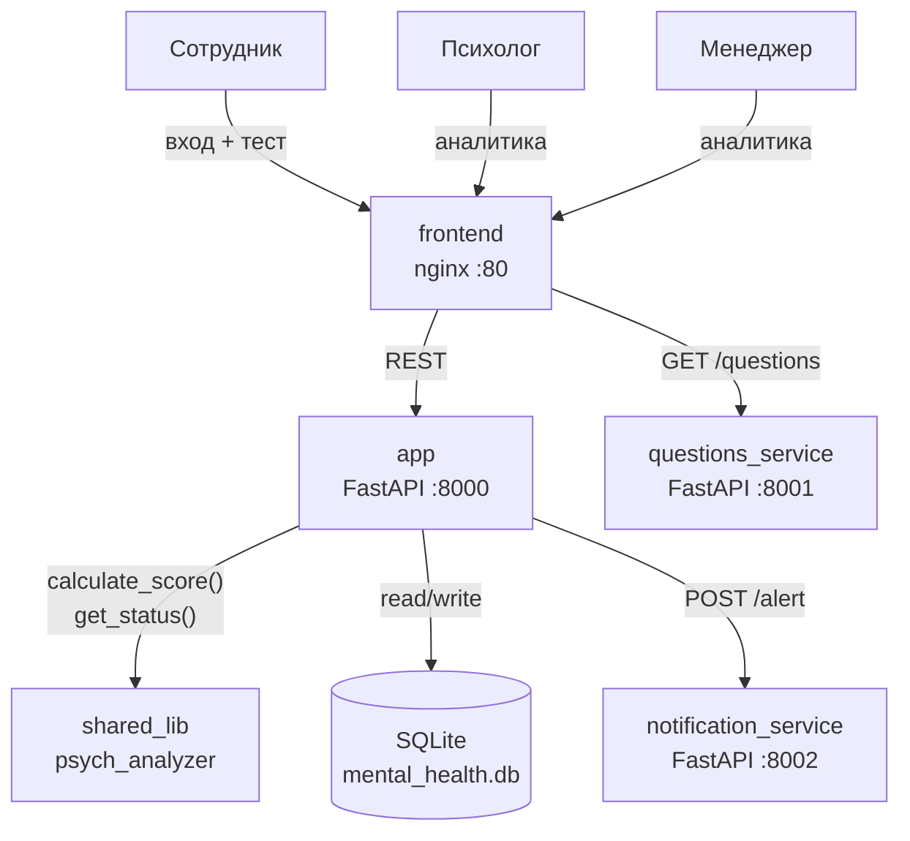
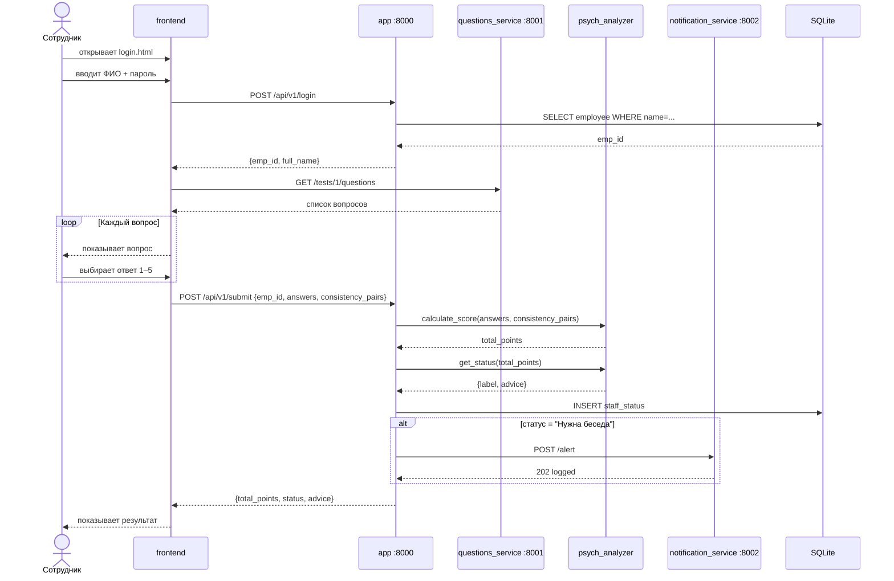

# Архитектура: mental_stats

## Компоненты

```
┌─────────────────────────────────────────────────────┐
│                     Browser                         │
│  login.html  assigment.html  index.html             │
└──────────────────────┬──────────────────────────────┘
                       │ HTTP (fetch)
          ┌────────────▼────────────┐
          │   frontend (nginx :80)  │
          └────────────┬────────────┘
                       │
          ┌────────────▼────────────┐
          │    app (FastAPI :8000)  │  ← главный бэкенд
          │  /api/v1/login          │
          │  /api/v1/submit         │
          │  /api/v1/analytics      │
          └──┬──────────────────┬───┘
             │                  │
  ┌──────────▼──────┐   ┌───────▼────────────────┐
  │ questions_service│   │ notification_service    │
  │  FastAPI :8001   │   │   FastAPI :8002          │
  │  /tests          │   │   /alert  /health        │
  └──────────────────┘   └────────────────────────┘

  ┌─────────────────────────┐   ┌──────────────────────┐
  │      shared_lib          │   │   SQLite (volume)     │
  │  psych_analyzer          │   │   employees           │
  │  engine.py  constants.py │   │   staff_status        │
  └──────────────────────────┘   └──────────────────────┘
           ↑                              ↑
           └── используется app ──────────┘
```

## Контекстная диаграмма



## Граница переиспользуемой логики

`shared_lib/src/psych_analyzer` — чистая библиотека без зависимостей от FastAPI или БД.
Опубликована на TestPyPI как пакет `psych_analyzer` и устанавливается в Docker-образ командой:

```
pip install --index-url https://test.pypi.org/simple/ \
            --extra-index-url https://pypi.org/simple/ \
            psych-analyzer
```

Для локальной разработки и тестов: `pip install -e shared_lib/`

## Поток данных: прохождение теста

1. Браузер → `login.html` → POST `/api/v1/login` → получает `emp_id`
2. Браузер → `assigment.html` → GET `questions_service:8001/tests/1/questions`
3. Сотрудник отвечает → POST `/api/v1/submit` с `emp_id`, массивом ответов и `consistency_pairs`
4. `app` вызывает `psych_analyzer.calculate_score()` и `get_status()`
5. Результат сохраняется в SQLite
6. Если статус "Нужна беседа" → POST `notification_service:8002/alert`

## Диаграмма последовательности: прохождение теста



## Сервисы и порты

| Сервис | Порт | Технология |
|---|---|---|
| frontend | 80 | nginx + HTML/CSS/JS |
| app | 8000 | FastAPI + SQLAlchemy |
| questions_service | 8001 | FastAPI + JSON |
| notification_service | 8002 | FastAPI |
